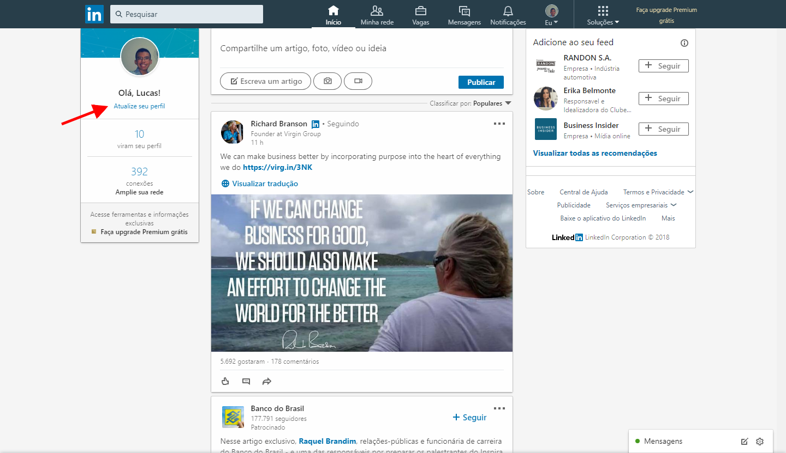
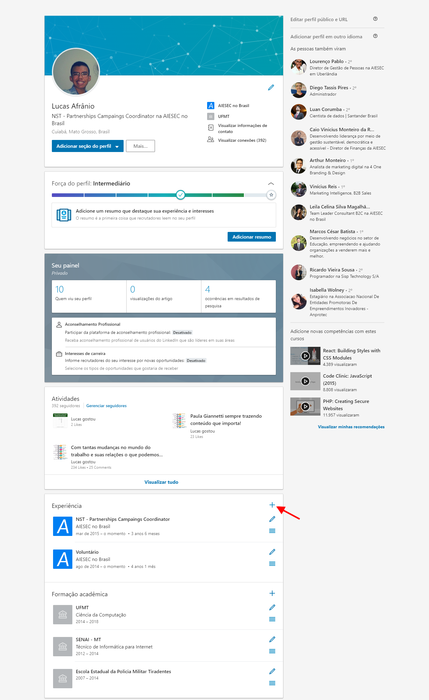
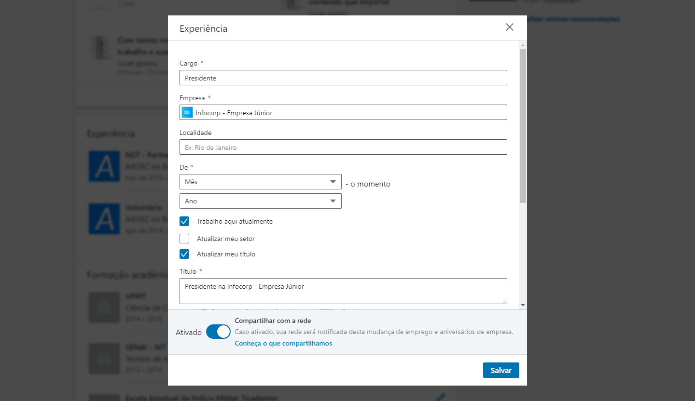

# Dicas para sua carreira

#### Material de apoio

Abaixo segue dois materiais oficiais que ajudarão vocês no preenchimento do seu perfil.

* [Guia do Estudante - Material Linkedin Oficial](https://drive.google.com/file/d/1Wdpvk3rdCnGPMB40bqbHdVAG6PAZt0G6/view?usp=sharing)

* [Apresentação Linkedin - Material Linkedin Oficial](https://drive.google.com/file/d/1D_lxLwg3h1qeEG41wzl3Jzad4UG-OZQg/view?usp=sharing)

Abaixo tem algumas máterias também:

* [13 dicas para melhorar seu perfil no Linkedin - Exame](https://exame.abril.com.br/carreira/13-dicas-para-melhorar-seu-perfil-no-linkedin/)
* [Montar portfolio desenvolvedor - Blog Udacity](https://br.udacity.com/blog/post/montar-portfolio-desenvolvedor)
* [Os 21 maiores erros de perfil no LinkedIn sob o olhar de uma headhunter](https://hackers.rockcontent.com/os-21-maiores-erros-de-perfil-no-linkedin-sob-o-olhar-de-uma-headhunter-dea7634c0cbc)

**Cursos sobre Carreira da Udacity:**

* [Aprimore seu currículo](https://br.udacity.com/course/refresh-your-resume--ud243)
* [Otimizando seu perfil do GitHub](https://br.udacity.com/course/optimize-your-github--ud247)
* [Construindo sua marca pessoal online](https://br.udacity.com/course/strengthen-your-linkedin-network-and-brand--ud242)
* [Entrevista técnica: Python](https://br.udacity.com/course/data-structures-and-algorithms-in-python--ud513)
* [Entrevista técnica: Swift](https://br.udacity.com/course/data-structures-and-algorithms-in-swift--ud1011)
* [Preparação para entrevistas de Cientista de Dados](https://br.udacity.com/course/data-science-interview-prep--ud944)
* [Entrevista técnica: Front-end](https://br.udacity.com/course/front-end-interview-prep--ud250)
* [Entrevista técnica: Android](https://br.udacity.com/course/android-interview-prep--ud241)
* [Entrevista técnica: Realidade Virtual VR](https://br.udacity.com/course/vr-interview-prep--ud251)
* [Entrevista técnica: Full Stack](https://br.udacity.com/course/full-stack-interview-prep--ud252)
* [Entrevista técnica: iOS](https://br.udacity.com/course/ios-interview-prep--ud240)

## **Como adicionar a minha XP na Infocorp no Linkedin?**

Primeiramente, logue em sua conta no Linkedin.

Depois acesse o seu perfil, e clique em "Atualize seu perfil"

Já em seu perfil, busque a sessão de "Experiências", e clique no botão de "+":

Quando abrir o modal, preenche os dados com as suas informações.

## **Editando o perfil**

### **1º - Cargo**

Segue a lista dos cargos possiveis.

| **Cargos**                 | 
| :------------------------: | 
| Presidente                 |
| Diretor Comercial          |
| Diretor Financeiro         |
| Diretor de Projetos        |
| Diretor de Desenvolvimento |
| Scrum Master               |
| Product Owner              |
| Desenvolvedor Back-End     |
| Desenvolvedor Front-End    |
| Analista                   |
| Marketing                  |
| Gestão                     |

### **2º - Nome da Empresa**

A **[Infocorp - Empresa Júnior](https://www.linkedin.com/company/infocorpconsultoria/)** tem o seu perfil no linkedin, então no campo de Empresas procure por "Infocorp" e selecione o perfil da EJ.

### **3º - Período**

Coloque o periodo em que você desempenhou aquela função dentro da EJ

### **4º - Descrição**

Busque personaliza a descrição, com as suas próprias palavras, com as lições aprendidas e com o desempenho que conseguiu durante aquele periodo.