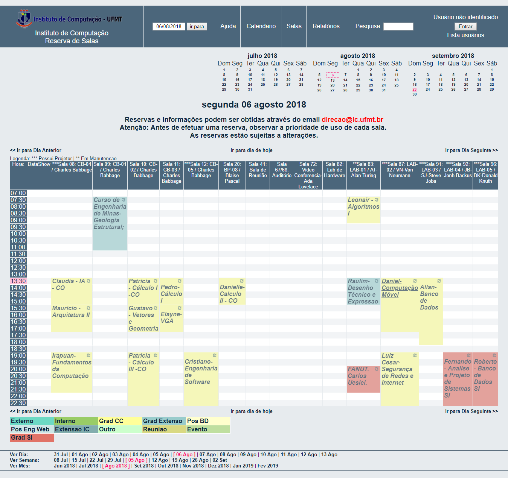

# Como realizar reservas de salas e laboratórios no IC

Primeiramente deve ser visto se a sala em questão está livre na data que se quer. Para isso acesse o site de reservas do IC: http://reservas.ic.ufmt.br.



O segundo passo é enviar um email para **direcao.ic.ufmt.br**, informando a data, horário, sala, descrição do evento e quem ficará responsável pelo evento (este será a pessoa que deve ir buscar a chave, preferencialmente no dia anterior caso for fazer uso no final de semana).

Abaixo segue um modelo de email:

```

Olá Direção,

Gostaria de solicitar a reserva do **nome da sala ** para o **nome do evento**, que tem como objetivo **descrever o foco do evento **. 

O evento será no dia **data do evento** das **horário do evento**, organizado pela Infocorp.

O **nome da pessoa responsável** ficará responsável pela chave.

Desde já agradeço a colaboração.

Abraços, 

```

Quando a solicitação for confirmada, a direção enviará uma resposta por email confirmando a solicitação.